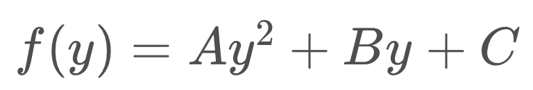
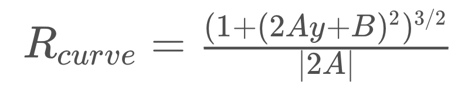

## Writeup Template

### You can use this file as a template for your writeup if you want to submit it as a markdown file, but feel free to use some other method and submit a pdf if you prefer.

---

**Advanced Lane Finding Project**

The goals / steps of this project are the following:

* Compute the camera calibration matrix and distortion coefficients given a set of chessboard images.
* Apply a distortion correction to raw images.
* Use color transforms, gradients, etc., to create a thresholded binary image.
* Apply a perspective transform to rectify binary image ("birds-eye view").
* Detect lane pixels and fit to find the lane boundary.
* Determine the curvature of the lane and vehicle position with respect to center.
* Warp the detected lane boundaries back onto the original image.
* Output visual display of the lane boundaries and numerical estimation of lane curvature and vehicle position.

[//]: # (Image References)

[test_image]: ./test_images/test3.jpg "Test Image"
[chess_undist]: ./output_images/undistort.png "Chess Undistorted"
[undist]: ./output_images/test_undistort.png "Road Undistorted"
[thresholded]: ./output_images/binary.png "Binary Example"
[warped]: ./output_images/warped.png "Warp Example"
[binary_warped]: ./output_images/binary_warped.png "Binary Warp"
[fit_line]: ./output_images/fit_line.png "Fit Visual"
[output]: ./output_images/test_output.png "Output"
[video1]: ./output_images/project4_output.mp4 "Video"

---

### Camera Calibration

#### 1. Briefly state how you computed the camera matrix and distortion coefficients. Provide an example of a distortion corrected calibration image.

Part 1 of the Jupyter notebook contains the code to obtain the
camera matrix and distortion coefficients from a set of chessboard
images.

I used the method given in the lecture, and the following description of the method by Udacity is great:

>I start by preparing "object points", which will be the (x, y, z) coordinates of the chessboard corners in the world. Here I am assuming the chessboard is fixed on the (x, y) plane at z=0, such that the object points are the same for each calibration image.  Thus, `objp` is just a replicated array of coordinates, and `objpoints` will be appended with a copy of it every time I successfully detect all chessboard corners in a test image.  `imgpoints` will be appended with the (x, y) pixel position of each of the corners in the image plane with each successful chessboard detection.

>I then used the output `objpoints` and `imgpoints` to compute the camera calibration and distortion coefficients using the `cv2.calibrateCamera()` function.  I applied this distortion correction to the test image using the `cv2.undistort()` function and obtained this result:

![alt text][chess_undist]

### Pipeline (single images)

The example I will use throughout the pipeline is:
![alt text][test_image]

#### 1. Provide an example of a distortion-corrected image.

The camera undistort function is defined as `cal_undistort()` in the notebook (part 1).
It uses `cv2.undistort()` function.

Below is the image undistorted with the `cal_undistort` function:
![alt text][undist]

#### 2. Describe how (and identify where in your code) you used color transforms, gradients or other methods to create a thresholded binary image.  Provide an example of a binary image result.

Part 2 in the Jupyter notebook is about thresholding an image, `thresholding()`
function.
I use three filters in the function:
- R-channel color filter to get the white lane line.
- S-channel color to get the yellow lane line.
- Sobel threshold in x-direction to get the line in parts affected by brightness (such as shadows).

We can see that the lines are picked up pretty well in the example image:

![alt text][thresholded]

Although my `thresholding()` function works with the project video, I need to
improve it for the more challenging videos. I will do that later when I have more
time.

#### 3. Describe how (and identify where in your code) you performed a perspective transform and provide an example of a transformed image.

Part 3 in the notebook is Perspective Transform. In this part, I define a function
`transform_pers()` that transform the perspective of the images recorded by the
dash camera to bird-eye (top-down) view.

The `transform_pers()` function takes as inputs an image (`img`), as well as source (`src`) and destination (`dst`) points.  I chose the hardcode the source and destination points in the following manner:

| Source        | Destination   |
|:-------------:|:-------------:|
| 190, 720      | 200, 0        |
| 1130, 720     | 200, 720      |
| 690, 450      | 900, 720      |
| 590, 450      | 900, 0        |

Using hardcode source and destination points is not the ideal approach. However,
I guess it will work as long as the same camera is used. Each camera would need
different source/destination points.

Here is the output of the `transform_pers()` function given the example image as
input.

![alt text][warped]

#### 4. Describe how (and identify where in your code) you identified lane-line pixels and fit their positions with a polynomial?

First I obtain a thresholded binary image from the input image:

![alt text][binary_warped]

To obtain the lane-line pixels, I use the sliding window method introduced in the
lecture. First, I find the starting point of each line by using histogram (number of points per column).
In each half of the image, the position that has the most points will be the line's starting point.
From the starting point, I find all the 'on' (white) pixels that fit the window.
The window width is [start_point - margin, start_point + margin] for an arbitrary
value of `margin` (default value = 100).

After getting all the points in the first
window, I calculate the middle point of these points, and set it as the starting point for the next window. We repeat the process until we reach the window in the top of
the image. Note that the first window is at the bottom of the image (lane starting),
and the last window is at the top (lane ending).

This video visualizes the whole process of finding lane lines by using sliding
window: https://www.youtube.com/watch?v=siAMDK8C_x8

With the lane-line pixels found, I fit a second polynomial line for each left and
right lane line using function `np.polyfit()`. The following image is the found
lane lines from the example image.

![alt text][fit_line]

Since in a normal video we would normally have at least 24 frames per second, the
lane lines in consecutive frames tend to be similar. With that in mind, we can
use the lane lines found in the last frame to guide the search in the next frame.

The `fast_search()` function in the notebook slides a window along the found lane lines in the last frame to find the lane-line pixels in the next frame.
Note that it is not always possible to find the lane lines using `fast_search()`
function. In such a case, I skip finding the lane lines in the current frame, and
use the normal finding lane line function in the next frame.

#### 5. Describe how (and identify where in your code) you calculated the radius of curvature of the lane and the position of the vehicle with respect to center.

Part 5 of the notebook is about finding the radius of curvature and position of the
car in the lane.

Suppose the lane line is represented by the equation:
<!--  -->

Then the radius of curvature can be calculated as:

To get the radius of curvature in unit of meters (rather than in unit of pixels), I need to convert distance in pixels to distance in meters.

Next, we want to know whether the vehicle is driving in the center of the lane. We can consider the center of the image as the position of the car since the camera is placed in the center of the car.
We can also find the center of the lane by calculating the middle point between two found lane lines. Then we know how much offset from the center the car is at any given frame.

Again, I need to convert distance in pixels to distance in meters so it becomes easier to estimate the distance in real-life space.

#### 6. Provide an example image of your result plotted back down onto the road such that the lane area is identified clearly.

In part 6 of the notebook, I define the function `draw_lane()` that takes an undistorted image as the input and use the functions described in preceding parts to draw the lane onto the original image.

The values of radius of curvature and offset from center are also plotted in the frame. Here is the lane drawn onto the example image.

![alt text][output]

---

### Pipeline (video)

#### 1. Provide a link to your final video output.  Your pipeline should perform reasonably well on the entire project video (wobbly lines are ok but no catastrophic failures that would cause the car to drive off the road!).

Here's a [link to my video result](./output_images/project4_output.mp4)

Part 7 shows the whole pipeline I use to generate the lane for each frame of the video. Let's go through all the steps in the pipeline:

- Undistort the input image.
- Obtain a thresholded binary image from the undistorted image.
- Transform the perspective of the binary image to bird-eye (top-down view).
- Find lane lines in the top-down binary image.
- Get the average line fit for left lane-line and right lane-line. (Note that the line fit for multiple frames are stored in a `Line` object).
- Draw the lane onto the original image, plus the radius of curvature and offset values.

---

### Discussion

#### 1. Briefly discuss any problems / issues you faced in your implementation of this project.  Where will your pipeline likely fail?  What could you do to make it more robust?

My approach to the project is following the steps mentioned in the lecture provided
by Udacity. I try to optimize each step in the pipeline. As far as I remember,
two most challenging steps are: thresholding the image, and transforming the
perspective.

While using color and gradient thresholding to obtain a binary image, as many advise
in the Slack channel, it helps to try different color channels. In transforming
perspective, the key is choosing the optimal destination set of points.

My current pipeline will probably fail in difficult situations, such as heavy
shadows, the lane lines and the road colors are similar, the road curve changes
suddenly, and possibly many more.

I have not tried the challenge videos due to my limited time. In the future, I will
work on improving the `thresholding()` function by looking at more color channels.
Another task is to deal with sharp curves on the road. I need to spend more time
on processing the line information across multiple frames.

I will show my work on the challenge videos later. 
